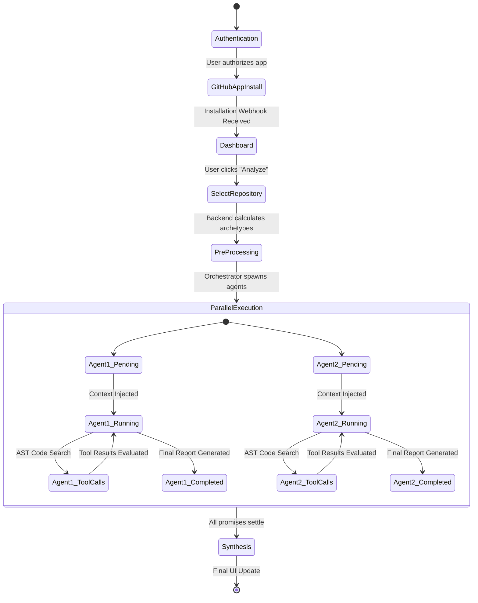

# Chapter 4: Design and Building

The transition from the conceptual problem statement and analytical methodology to a fully realized, production-ready application requires rigorous architectural planning. The automated repository analysis platform is not a simple CRUD (Create, Read, Update, Delete) application; it is a highly concurrent, stateful, and compute-intensive system. It must securely manage external authentication tokens, orchestrate non-deterministic AI agents, parse massive abstract syntax trees, and stream real-time updates to a web client. 

This chapter provides an exhaustive breakdown of the design phase, detailing the system workflow, the underlying architectural patterns, the database schema, and the intricate data flows that allow the platform to operate at scale.

## 4.1 Design Phase

The design philosophy for this platform centers around four core pillars: **Scalability**, **Modularity**, **Security**, and **Real-Time Observability**. Every architectural decision and technology selection was made to support these pillars.

### Technology Stack Selection and Justification

The selection of the technology stack is the most critical decision in the design phase. The platform utilizes a modern, JavaScript/TypeScript-centric stack to ensure end-to-end type safety and rapid development iteration.

*   **Frontend Framework (Next.js & React 19):** Next.js (utilizing the App Router) was selected as the foundational framework. Its support for server-side rendering (SSR) and React Server Components (RSC) allows for blazing-fast initial page loads, which is crucial for complex dashboards. React 19 provides the necessary concurrency features to handle the high-frequency UI updates required by the real-time agent streaming.
*   **Styling and UI Library (Tailwind CSS & Shadcn UI):** To maintain a premium, dynamic, and responsive aesthetic without writing thousands of lines of bespoke CSS, Tailwind CSS is used for utility-first styling. Shadcn UI provides accessible, highly customizable component primitives (like accordions, dialogs, and progress bars) that form the building blocks of the analysis dashboard.
*   **Backend and API (Next.js Serverless & tRPC):** Next.js API routes act as the backend. However, to ensure absolute type safety between the frontend components and the backend logic, tRPC (TypeScript Remote Procedure Call) is heavily utilized. This prevents runtime errors caused by mismatched data expectations between the client and server.
*   **Database and ORM (PostgreSQL & Prisma):** PostgreSQL is selected for its robust relational data integrity and ability to handle complex queries. Prisma acts as the Object-Relational Mapper (ORM), providing a strictly typed schema definition and a programmatic interface for database interactions, entirely eliminating the risk of SQL injection vulnerabilities in the core application logic.
*   **AI and Orchestration (LangChain & LangGraph):** While OpenAI provides the underlying Large Language Models (LLMs), managing the state and tool-calling logic of multiple agents requires a dedicated framework. LangGraph is selected over linear LangChain because it allows for the creation of cyclical, stateful graphs. This means an agent can search for code, evaluate the result, and decide to search again if the context was insufficient—a loop impossible in standard linear prompt chains.
*   **Authentication (Clerk):** Security is offloaded to Clerk, an enterprise-grade authentication provider. Clerk handles session management, multi-factor authentication, and the crucial OAuth handshakes required to securely interact with the GitHub API on behalf of the user.

## 4.1.1 System Workflow Design

The system workflow is designed to abstract the immense complexity of multi-agent orchestration away from the user. From the user's perspective, the workflow is linear and frictionless. From the system's perspective, it is highly parallel and state-driven.

### The User Journey and System Execution

1.  **Onboarding and Authentication:** The user authenticates via Clerk. To analyze private repositories, the user is prompted to install the platform's custom GitHub App. This workflow utilizes standard OAuth 2.0. The system does *not* store the user's GitHub password; instead, it stores a `githubInstallationId` via a secure webhook callback.
2.  **Repository Selection:** The frontend displays a list of repositories accessible via the GitHub App installation. The user selects a target repository and clicks "Analyze."
3.  **The Orchestrator Trigger:** The frontend sends a single API request to the backend `/api/agent/orchestrate` route. This route acts as the entry point for the entire asynchronous workflow.
4.  **Archetype Pre-processing:** Before any LLM is invoked, a deterministic script scans the repository's configuration files. It assigns scores to various archetypes (e.g., Database-Heavy, Auth-Heavy). 
5.  **Agent Queuing and Database Upsertion:** The orchestrator writes the pending tasks to the PostgreSQL database. For a repository tagged as both DB-heavy and Auth-heavy, two distinct `AgentReport` records are created with a status of `pending`.
6.  **Parallel Graph Execution:** The LangGraph instances are initialized. The `runDatabaseAgent` and `runAuthAgent` are fired concurrently via `Promise.allSettled()`. Each agent receives its own isolated state, memory, and specialized system prompt.
7.  **Real-Time Streaming:** As the agents execute tools (e.g., `searchCodeTool`) and stream internal thoughts, the orchestrator utilizes Server-Sent Events (SSE) to push these updates directly to the client's browser.
8.  **Synthesis and Completion:** Once an agent reaches a terminal node in its LangGraph execution, it outputs a final JSON report. The orchestrator updates the PostgreSQL database status to `completed` and streams the final payload to the UI.

### Workflow Visualization



## 4.1.2 System Architecture Design

The application architecture follows a highly decoupled, layered modular design. This prevents the "spaghetti code" problem that the platform itself is designed to detect in other repositories.

### Layered Architecture Breakdown

1.  **Presentation Layer (`src/app`, `src/components`):** This layer contains all Next.js page layouts, routing, and React components. It is strictly responsible for rendering the UI and managing client-side state (using hooks like `useState` and `useEffect`). It does not contain business logic.
2.  **Application / API Layer (`src/app/api`, `src/actions`):** This layer defines the API endpoints and Server Actions. It acts as the bridge between the client and the core logic. It handles request validation (using Zod schemas), authentication checks, and initiates the orchestrator.
3.  **Domain / Orchestration Layer (`actions/agents/`):** This is the core intelligence of the application. It contains the `orchestrator.ts` file, which manages the lifecycle of the analysis. It also houses the specific LangGraph implementations for each agent archetype (e.g., `db.ts`, `auth.ts`). This layer is completely isolated from HTTP requests; it operates strictly on internal function calls.
4.  **Data Access Layer (`lib/prisma.ts`):** This layer abstracts all interactions with the PostgreSQL database. Only Prisma client invocations exist here. By keeping database logic isolated, the application can easily implement caching mechanisms or migrate database providers in the future.

### Database Schema Design

The relational database schema is designed for performance and auditability. The core models are defined in `schema.prisma`.

*   **`User` Model:** Stores user metadata, subscription tiers, and critically, the `githubInstallationId`. This ID is the key to generating short-lived access tokens.
*   **`Repository` Model:** Represents a single GitHub repository. It contains metadata like the `repositoryId` (from GitHub), the `name`, and an array of `archetypes` computed during the pre-processing phase. It maintains a many-to-one relationship with the `User` model.
*   **`AgentReport` Model:** This is the most frequently updated table during an analysis. It maintains a compound unique constraint on `[repositoryId, archetype]`. This ensures that a repository can only have one active report per archetype at a time. It tracks the `status` (pending, running, completed, failed), the `executionTimeMs`, the `totalToolCalls`, and a JSONB column containing the `rawFindings` generated by the LLM.

### Architecture Visualization

```mermaid
graph TD
    Client[Web Browser / React] -->|HTTP / tRPC| API[Next.js API Layer]
    Client <..>|Server-Sent Events| Orchestrator
    
    API -->|Validates & Triggers| Orchestrator[Agent Orchestrator]
    API -->|Reads / Writes| Prisma[Prisma ORM]
    
    Orchestrator -->|Spawns| LangGraph_DB[Database Agent Graph]
    Orchestrator -->|Spawns| LangGraph_Auth[Auth Agent Graph]
    
    LangGraph_DB -->|Tool Execution| Octokit[GitHub API Client]
    LangGraph_Auth -->|Tool Execution| Octokit
    
    LangGraph_DB -->|LLM Prompts| OpenAI[OpenAI / GPT-4]
    LangGraph_Auth -->|LLM Prompts| OpenAI
    
    Octokit <--> GitHub[GitHub Servers]
    Prisma <--> PostgreSQL[(PostgreSQL Database)]
```

## 4.1.3 Data Flow Design

Understanding the flow of data—specifically how sensitive authentication tokens and massive code payloads move through the system—is crucial for evaluating the security and performance of the design.

### Secure Token Exchange Flow

To analyze a private repository, the system must authenticate with GitHub. Storing personal access tokens in a database is a massive security risk. Instead, the data flow utilizes short-lived installation tokens.

1.  **Webhook Receipt:** When a user installs the GitHub app, GitHub sends a webhook containing the `installation.id`.
2.  **Database Storage:** The system stores only this `installation.id` in the `User` table.
3.  **Just-In-Time Generation:** When the orchestrator is triggered, it reads the `installation.id`. It uses the platform's private key (stored securely in environment variables, never in the database) to sign a JSON Web Token (JWT).
4.  **Token Request:** The system sends this JWT to GitHub to request an installation access token.
5.  **Context Injection:** GitHub returns a token valid for only 1 hour. This token is injected directly into the memory context of the LangGraph agents.
6.  **Volatility:** When the analysis completes, the token is discarded from memory. Even if the database is compromised, the attacker only gains an `installation.id`, which is useless without the server's encrypted private key.

### Real-Time SSE (Server-Sent Events) Pipeline

Traditional HTTP requests are synchronous; the client asks for data and waits until the server responds. For an agent analysis that might take 3 to 5 minutes, synchronous HTTP requests would result in browser timeouts and a terrible user experience.

To solve this, the data flow utilizes Server-Sent Events (SSE).

1.  **Connection Establishment:** The frontend React component opens a long-lived, unidirectional HTTP connection to the backend `/api/agent/orchestrate` endpoint using the `EventSource` API.
2.  **Event Emission:** Inside the backend orchestrator, a callback function `onEvent(event)` is passed down into the deep recesses of the LangGraph execution nodes.
3.  **Stream Pushing:** Every time an agent updates its state (e.g., changes from "Thinking" to "Executing Tool"), the callback is fired. The backend immediately writes this chunk of JSON data to the open HTTP stream.
4.  **Client-Side Hydration:** The React frontend receives the chunk, parses the JSON, and updates its local state array. Because React 19 handles concurrent rendering, the UI updates smoothly, animating progress bars and terminal windows in real-time without overwhelming the browser's main thread.

This continuous, unidirectional data flow is the technical foundation that allows founders to watch the AI audit their codebase line-by-line, creating trust and transparency in the automated process.
