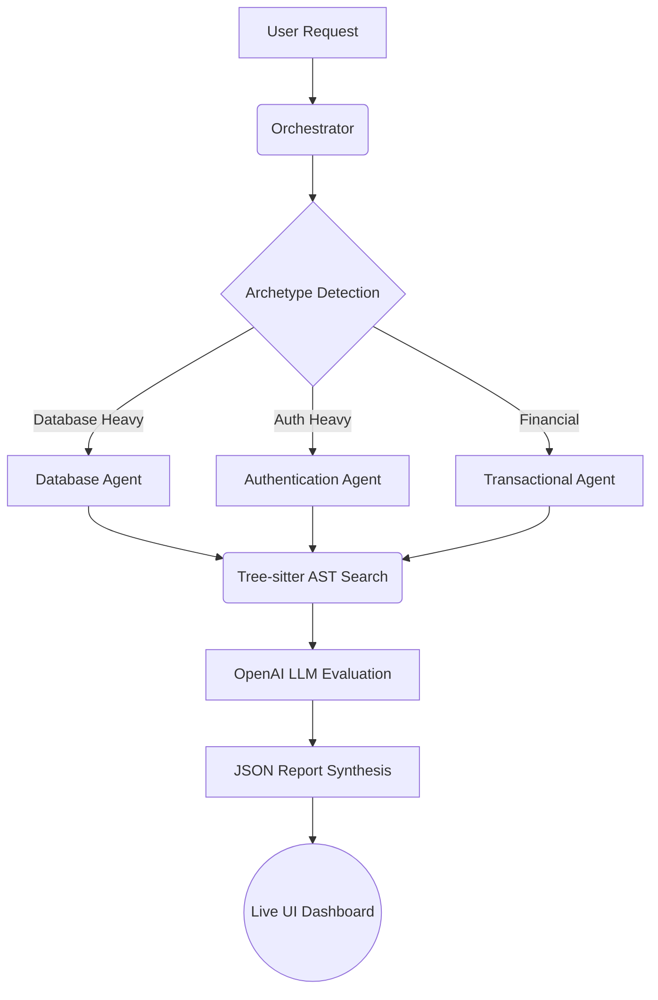
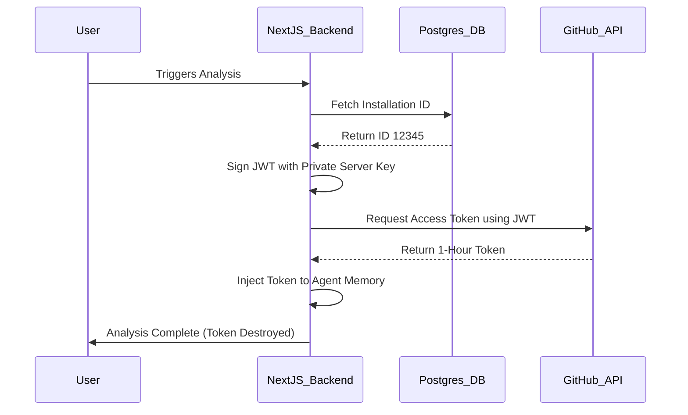
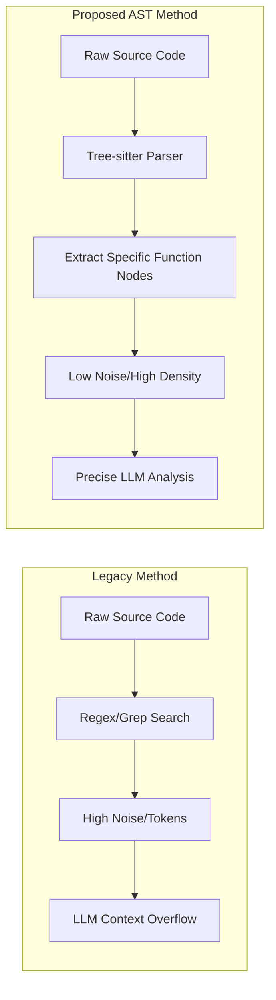
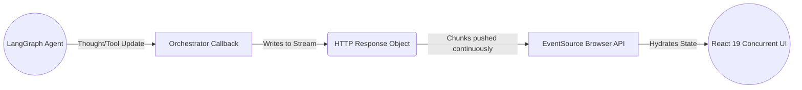

# Figures and Tables for the Report

Below are the figures (generated as Mermaid diagrams which can be rendered directly or screenshotted for your report) and tables designed to be placed throughout your chapters. 

## Figures

### Figure 1: High-Level Orchestration Architecture
This figure illustrates the graph-based execution of multiple agents in parallel. (Place in Chapter 4)

_Figure 1: High-Level Multi-Agent Orchestration Architecture_

### Figure 2: Secure Context Injection Flow
This sequence diagram shows how short-lived access tokens are generated without storing credentials. (Place in Chapter 5)

_Figure 2: Secure Just-In-Time Context Injection Protocol_

### Figure 3: Abstract Syntax Tree (AST) vs Raw Text Parsing
This flowchart compares the legacy method of feeding raw code to LLMs versus the AST method. (Place in Chapter 3)

_Figure 3: Abstract Syntax Tree Parsing vs Traditional Raw Text Ingestion_

### Figure 4: Server-Sent Events (SSE) Real-Time Data Flow
This diagram shows the unidirectional streaming of data to the frontend React application. (Place in Chapter 4 or 5)

_Figure 4: Server-Sent Events Data Pipeline_

---

## Tables

### Table 1: Comparison of Traditional Static Analysis vs Agentic LLM Analysis
(Place in Chapter 2: Problem Statement)

| Feature | Traditional Static Analysis (e.g., ESLint) | Agentic LLM Analysis |
| :--- | :--- | :--- |
| Logic Understanding | Rigid rule-based checking. | Semantic understanding of intent. |
| Architectural Insight | Cannot detect N+1 query structures easily. | Maps data flow to spot systemic bottlenecks. |
| Context Awareness | Operates on single files in isolation. | Understands dependencies across the entire repository. |
| Adaptability | Requires manual rule configuration. | Dynamically adapts via Archetype Detection. |

_Table 1: Feature comparison demonstrating the necessity of Agentic LLM Analysis for complex architectures._

### Table 2: Agent Archetype Responsibilities and Primary Tools
(Place in Chapter 3: Analysis)

| Agent Persona | Trigger Criteria | Primary Audit Focus | Core Tools Utilized |
| :--- | :--- | :--- | :--- |
| Database Scalability | Prisma schemas, high SQL volume | Connection pooling, missing composite indexes, N+1 loops | searchCodeTool, AST Parser |
| Authentication | Presence of Clerk, NextAuth, JWTs | Session management, hardcoded secrets, insecure cookies | searchCodeTool, Config Parser |
| Financial/Transactional | Stripe SDKs, Cart states | Idempotency failures, webhook validation, data consistency | searchCodeTool, Flow Analyzer |

_Table 2: Breakdown of specialized agent personas, their activation triggers, and focus areas._

### Table 3: Database Schema Mapping for Orchestration State
(Place in Chapter 4: Design and Building)

| Database Model | Primary Function | Key Fields | Relationship to Workflow |
| :--- | :--- | :--- | :--- |
| User | Authentication and linking | githubInstallationId | Required to mint secure API tokens. |
| Repository | Target codebase metadata | archetypes, repositoryId | Determines which agents the orchestrator will spawn. |
| AgentReport | Tracking parallel execution | status, executionTimeMs, rawFindings | Continuously updated and streamed to the UI via SSE. |

_Table 3: PostgreSQL schema mapping demonstrating how state is persisted during asynchronous agent execution._
